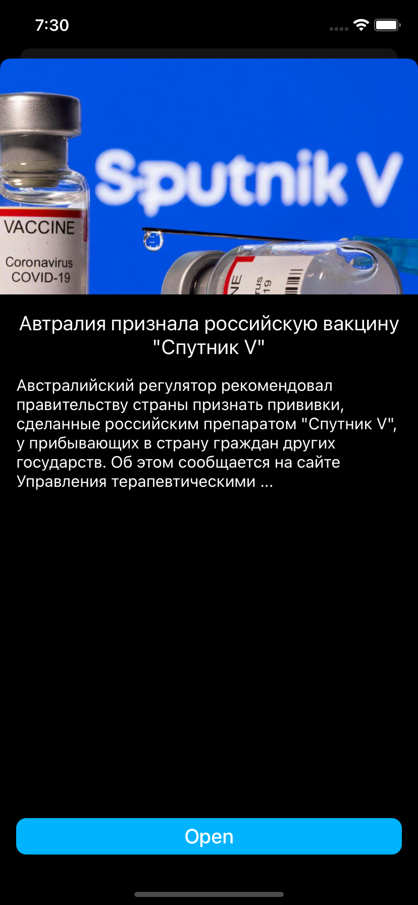
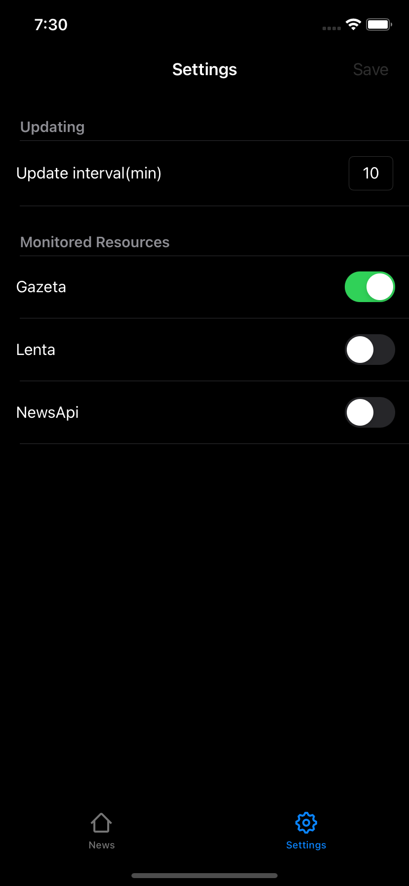

## NewsAggregator
This is a simple application built using the [MVVM](https://en.wikipedia.org/wiki/Model–view–viewmodel) + Coordinator + Router design pattern.
Application [Requirements](Docs/Task.md).
I tried to follow the [SOLID](https://en.wikipedia.org/wiki/SOLID) principles.

[](https://github.com/muzle/NewsAggregator/blob/master/LICENSE)
[](https://codebeat.co/projects/github-com-muzle-newsaggregator-master)

<table>
<tr>
    <th rowspan="9"></th>
    <th rowspan="9"></th>
    <th rowspan="9"></th>
  </tr>
</table>

## Instalation
1. The project uses the [Cocoapods](https://cocoapods.org) dependency manager, so the first step is to install it. The installation process is described in the official documentation.
2. After installing the [Cocoapods](https://cocoapods.org), run the following set of commands in a terminal:
```shell
git clone https://github.com/muzle/NewsAggregator.git
cd NewsAggregator
pod install
open NewsAggregator.xcworkspace
```

## Authors
Eugene Rudakov - [linkedin](https://www.linkedin.com/in/voragomod/)